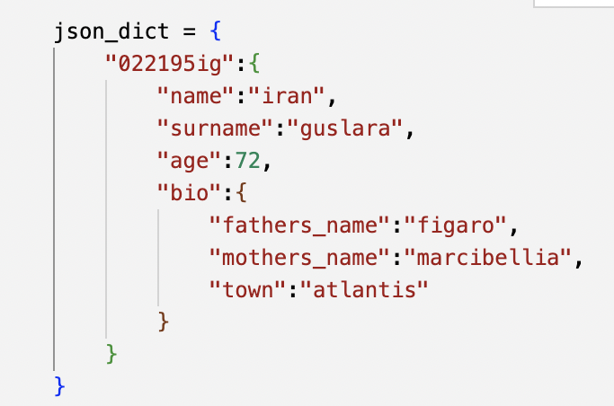
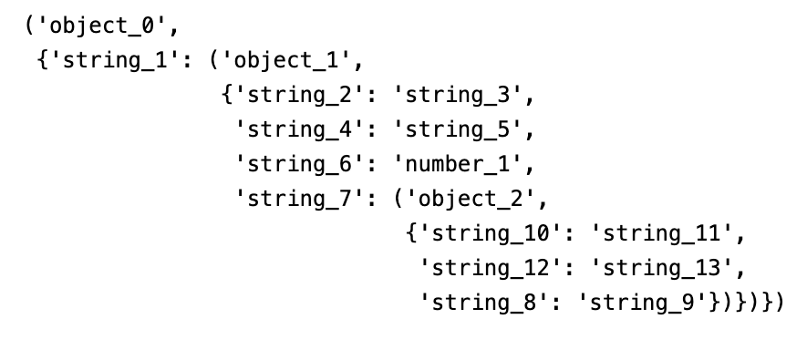

# JSONCorruptor class #
#### (in corruptor.py)
I've figured this is the robust solution I was looking for.
It is initialized with a json-compatible dict. During initialization, it creates a schema representation of the json structure, but separates the actual data (values).

in this example, "string_2" is mapped to "name", "string_3" to "iran" etc.

This approach keeps the data safe from harm, once the corruptions are done, the data is inserted in place of its pair.

_____
# JSONCorruptor.corrupt() method #
Makes a number of corruptions, inserts the data and formats to string representation. Returns the string representation with the corruptions and intact data.